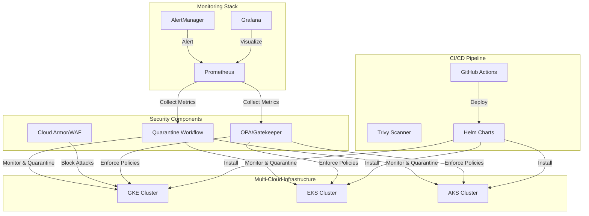
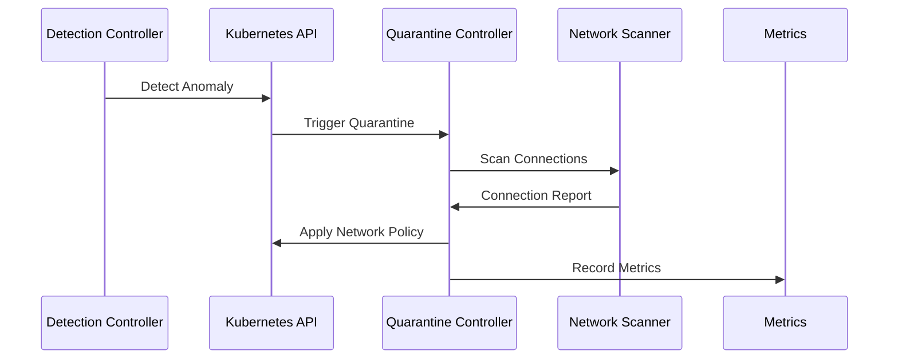
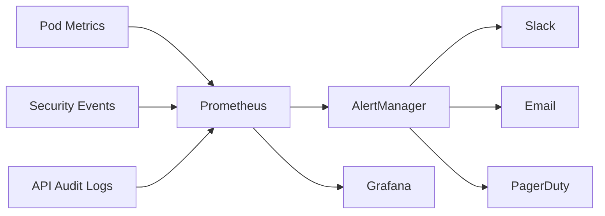

# Kubernetes Zero-Day Mitigation Framework

[](LICENSE)
[](https://kubernetes.io)
[](https://helm.sh)

A comprehensive framework for detecting, isolating, and mitigating zero-day vulnerabilities in Kubernetes clusters. This project implements automated quarantine workflows, runtime security policies, and advanced monitoring capabilities across multi-cloud environments.

## Table of Contents
- [Architecture](#architecture)
- [Features](#features)
- [Prerequisites](#prerequisites)
- [Installation](#installation)
- [Configuration](#configuration)
- [Usage](#usage)
- [Security Controls](#security-controls)
- [Monitoring & Alerting](#monitoring--alerting)
- [Testing](#testing)
- [Contributing](#contributing)

## Architecture



## Features

### Core Capabilities
- **Automated Pod Quarantine**: Identifies and isolates potentially compromised pods
- **Runtime Security Policies**: OPA/Gatekeeper policies for preventive security
- **Multi-Cloud Support**: Works across GKE, EKS, and AKS
- **Advanced Monitoring**: Prometheus & Grafana integration with custom dashboards
- **CI/CD Integration**: Automated deployment and security scanning

### Security Features
- Real-time vulnerability scoring
- Network policy enforcement
- Pod security standards
- Container image scanning
- Forensics data collection

### Monitoring & Alerting
- Custom security dashboards
- Real-time metric collection
- Multi-channel alerting
- Trend analysis
- Success rate tracking

## Prerequisites

- Kubernetes 1.29+
- Helm 3.0+
- kubectl
- Access to one of:
  - Google Kubernetes Engine (GKE)
  - Amazon Elastic Kubernetes Service (EKS)
  - Azure Kubernetes Service (AKS)

## Installation

1. **Clone the Repository**
```bash
git clone https://github.com/yourusername/kubernetes-zero-day-framework.git
cd kubernetes-zero-day-framework
```

2. **Install with Helm**
```bash
# Add required Helm repositories
helm repo add prometheus-community https://prometheus-community.github.io/helm-charts
helm repo add grafana https://grafana.github.io/helm-charts
helm repo update

# Install the framework
helm install zero-day-framework ./k8s/helm/zero-day-framework
```

3. **Configure Cloud Provider**

For GKE:
```bash
terraform init
terraform apply -var="project_id=your-project-id"
```

For EKS:
```bash
terraform init
terraform apply -var="aws_region=us-west-2"
```

For AKS:
```bash
terraform init
terraform apply -var="location=eastus"
```

## Configuration

### Quarantine Workflow Settings
```yaml
quarantine:
  schedule: "*/5 * * * *"
  thresholds:
    restartCount: 5
    memoryUsagePercent: 90
    cpuUsagePercent: 80
```

### Security Policies
```yaml
policies:
  enforcePrivileged: true
  allowedRepositories:
    - gcr.io/my-project/*
    - docker.io/bitnami/*
  networkPolicies:
    enabled: true
    defaultDeny: true
```

## Usage

### Manual Pod Quarantine
```bash
kubectl label pod <pod-name> quarantine-status=pending
```

### View Security Metrics
```bash
kubectl port-forward svc/grafana 3000:3000
# Access Grafana at http://localhost:3000
```

### Run Security Tests
```bash
# Run comprehensive test suite
./tests/run_advanced_tests.sh

# Run chaos tests
./tests/run_chaos_tests.sh
```

## Security Controls

### Pod Security Policies
- Non-root containers
- Read-only root filesystem
- Drop all capabilities
- Resource limits enforcement

### Network Policies
- Default deny
- Selective ingress/egress
- Service mesh integration
- DNS policy enforcement

### Runtime Security
- OPA/Gatekeeper policies
- Container vulnerability scanning
- Behavioral analysis
- Resource monitoring

## Monitoring & Alerting

### Metrics
- Quarantine actions
- Vulnerability scores
- Success rates
- Resource usage

### Dashboards
- Security Overview
- Vulnerability Tracking
- Quarantine Analytics
- Resource Monitoring

### Alerts
- High quarantine rate
- Policy violations
- System anomalies
- Resource exhaustion

## Performance Benchmarks

### Resource Usage

| Component | CPU (avg) | Memory (avg) | Network I/O | Storage I/O |
|-----------|-----------|--------------|-------------|-------------|
| Quarantine Controller | 0.2 cores | 256MB | 5MB/s | 1MB/s |
| OPA/Gatekeeper | 0.5 cores | 512MB | 10MB/s | 2MB/s |
| Prometheus | 1.0 cores | 2GB | 20MB/s | 50MB/s |
| Grafana | 0.3 cores | 512MB | 5MB/s | 1MB/s |

### Scalability Tests

Tested on cluster sizes:
- Small (10-50 nodes)
- Medium (50-200 nodes)
- Large (200-1000 nodes)

| Metric | Small | Medium | Large |
|--------|-------|--------|-------|
| Pod Quarantine Time | <2s | <5s | <10s |
| Policy Evaluation | <100ms | <200ms | <500ms |
| Alert Latency | <1s | <2s | <5s |

## Component Architecture

### Quarantine Workflow


### Monitoring Pipeline


## Advanced Configuration Examples

### Fine-tuned OPA Policies
```yaml
apiVersion: constraints.gatekeeper.sh/v1beta1
kind: K8sRestrictedPods
metadata:
  name: restrict-pod-security
spec:
  match:
    kinds:
      - apiGroups: [""]
        kinds: ["Pod"]
    excludedNamespaces: ["kube-system"]
  parameters:
    privileged: false
    allowPrivilegeEscalation: false
    readOnlyRootFilesystem: true
    allowedCapabilities: ["NET_BIND_SERVICE"]
    requiredDropCapabilities: ["ALL"]
    runAsUser:
      rule: "MustRunAsNonRoot"
    seccompProfile:
      type: "RuntimeDefault"
```

### Advanced Network Policies
```yaml
apiVersion: networking.k8s.io/v1
kind: NetworkPolicy
metadata:
  name: zero-day-quarantine
spec:
  podSelector:
    matchLabels:
      quarantine-status: active
  policyTypes:
    - Ingress
    - Egress
  ingress:
    - from:
      - namespaceSelector:
          matchLabels:
            name: security-tools
      ports:
        - protocol: TCP
          port: 443
  egress:
    - to:
      - namespaceSelector:
          matchLabels:
            name: logging
      ports:
        - protocol: TCP
          port: 5170
```

### Prometheus Rules
```yaml
groups:
- name: ZeroDayAlerts
  rules:
  - alert: HighQuarantineRate
    expr: sum(rate(quarantine_actions_total[5m])) > 10
    for: 5m
    labels:
      severity: critical
    annotations:
      description: "High number of quarantine actions detected"
  - alert: PolicyViolations
    expr: sum(rate(policy_violations_total[15m])) > 5
    for: 15m
    labels:
      severity: warning
```

## Troubleshooting Guide

### Common Issues

#### 1. Quarantine Controller Not Responding
```bash
# Check controller logs
kubectl logs -n security-tools deploy/quarantine-controller

# Verify RBAC permissions
kubectl auth can-i create networkpolicies --as system:serviceaccount:security-tools:quarantine-controller

# Check controller health
kubectl describe pod -n security-tools -l app=quarantine-controller
```

#### 2. OPA Policy Issues
```bash
# View policy status
kubectl get constraints
kubectl get constrainttemplates

# Check OPA logs
kubectl logs -n gatekeeper-system deploy/gatekeeper-controller-manager
```

#### 3. Monitoring Stack Problems
```bash
# Verify Prometheus targets
kubectl port-forward svc/prometheus 9090:9090
# Visit http://localhost:9090/targets

# Check Grafana datasources
kubectl exec -n monitoring deploy/grafana -- curl -s http://localhost:3000/api/datasources
```

#### 4. Performance Issues
```bash
# Check resource usage
kubectl top pods -n security-tools
kubectl top pods -n monitoring

# View detailed metrics
kubectl get --raw /apis/metrics.k8s.io/v1beta1/pods
```

### Debug Mode

Enable debug logging:
```yaml
controller:
  logLevel: debug
  tracing:
    enabled: true
    samplingRate: 1.0
```

### Health Checks

Component health verification:
```bash
# Run health check script
./scripts/health-check.sh

# Individual component checks
curl -k https://<controller-ip>:8080/healthz
curl -k https://<controller-ip>:8080/metrics
```

## Testing

### Integration Tests
```bash
./tests/run_integration_tests.sh
```

### Chaos Testing
```bash
./tests/run_chaos_tests.sh
```

## Project Structure
```
├── .github/
│   └── workflows/          # CI/CD pipeline configurations
├── chaos/
│   └── advanced-chaos.yaml # Chaos testing configurations
├── cloud-armor/
│   └── waf-policy.json    # Cloud Armor WAF rules
├── k8s/
│   └── helm/              # Helm charts and templates
├── monitoring/
│   ├── dashboards/        # Grafana dashboard configurations
│   └── prometheus/        # Prometheus rules and configs
├── policies/
│   ├── opa-policy.yaml    # OPA/Gatekeeper policies
│   └── security-controls.yaml # Additional security policies
├── quarantine/
│   ├── quarantine-workflow.yaml # Main quarantine CronJob
│   └── rbac.yaml          # RBAC configurations
├── terraform/
│   ├── gke.tf            # GKE infrastructure
│   ├── eks.tf            # EKS infrastructure
│   └── aks.tf            # AKS infrastructure
├── tests/
│   ├── advanced-test-pods.yaml
│   ├── run_advanced_tests.sh
│   └── run_chaos_tests.sh
├── .gitignore
└── README.md
```

## Contributing

1. Fork the repository
2. Create your feature branch
3. Commit your changes
4. Push to the branch
5. Create a Pull Request


## References
- [OPA/Gatekeeper](https://github.com/open-policy-agent/gatekeeper)
- [Google Cloud Armor](https://cloud.google.com/armor)
- [Kubernetes Security Best Practices](https://kubernetes.io/docs/concepts/security/)
- [CVE-2023-1675](https://nvd.nist.gov/vuln/detail/CVE-2023-1675)

## Acknowledgments

- Kubernetes Community
- OPA/Gatekeeper Contributors
- Cloud Provider Teams (Google, AWS, Azure)
- Open Source Security Tools Contributors
